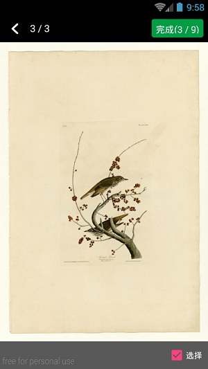

# PhotoSelector

Photo Selector for Android device. Support single choice and multi-choice.

###ART
  

-------------------
 

###Quick Start 

* Step 0 Add module selectorPhotoLibrary as your dependence.

	
		dependencies { 
	   		 compile project(':selectorphotolibrary')
		}

* Step 1
  

			ImgOptions options = new ImgOptions(selectedMode, showCamera);
            startActivityForResult(SelectedPhotoActivity.makeIntent(MainActivity.this, options), REQUEST_IMAGE);
	
 

* Step 2
Receive result 

 
		    @Override
            protected void onActivityResult(int requestCode, int resultCode, Intent data) {
                super.onActivityResult(requestCode, resultCode, data);
                if (requestCode == REQUEST_IMAGE) {
                    if (resultCode == RESULT_OK) {
                        ArrayList<String> pathList = data.getStringArrayListExtra(EXTRA_DATA);
                        for (String path : pathList) {
                            mResultText.append(path);
                            mResultText.append("\n");
                        }
                    }
                }
            }

  

 
 
---
预想
#新特性
现在缺的是截图部分的内容，以前有过一个库，考虑整合起来。

# GalleryFinal

今天看到一个更强大的库， 地址：https://github.com/pengjianbo/GalleryFinal

### Thanks

base: [MultiImageSelector](https://github.com/lovetuzitong/MultiImageSelector)

use : [TouchImageView](https://github.com/MikeOrtiz/TouchImageView)

### License

> The MIT License (MIT)
> 
> Copyright (c) 2015 Nereo
> 
> Permission is hereby granted, free of charge, to any person obtaining a copy of this software and associated documentation files (the "Software"), to deal in the Software without restriction, including without limitation the rights to use, copy, modify, merge, publish, distribute, sublicense, and/or sell copies of the Software, and to permit persons to whom the Software is furnished to do so, subject to the following conditions:
> 
> The above copyright notice and this permission notice shall be included in all copies or substantial portions of the Software.  
